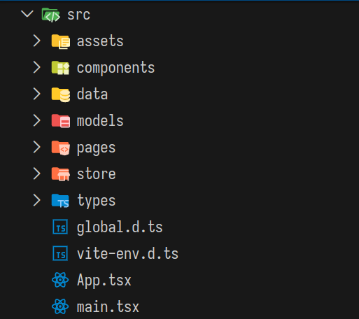

# BisaBerisyarat

Aplikasi belajar bahasa isyarat menggunakan Sistem Isyarat Bahasa Indonesia (SIBI) untuk anak-anak berbasis aplikasi desktop. Dibuat menggunakan [Electron-Vite](https://electron-vite.github.io/) + [React](https://react.dev/) + [Tailwind](https://tailwindcss.com/)

# Development
## Main Structure of The Project


File utama dari project berada di `/src`, berikut ini adalah isi dan fungsi dari masing-masing folder
1. `/src/assets`: berisi assets yang digunakan dalam project, misal gambar huruf dan suara
2. `/src/components`: berisi komponen custom seperti Card, Navbar, dan Radio, sehingga bisa digunakan diberbagai halaman hanya dengan nama komponennya (tanpa perlu menulis ulang kode)
3. `/src/data`: berisi file .json (read-only) seperti letter.json dan word.json, yang nantinya digunakan ketika membuat objek di dalam program
4. `/src/models`: berisi file Class yang digunakan untuk membuat objek dengan konsep PBO (Pemrograman Berorientasi Objek)
5. `/src/pages`: berisi file .tsx yang berfungsi sebagai user interface untuk ditampilkan ke layar pengguna
6. `/src/stores`: berisi file yang digunakan agar objek-objek dari class yang sudah dibuat/di-inisialisasi bisa diakses antar halaman (dapat diakses di semua halaman)
7. `/src/types`: berisi tipe data custom agar tidak perlu menulis ulang tipe data yang sama berulang kali

**Catatan:** Tempat penyimpanan progres pengguna (app-data.json) berbeda-beda tergantung sistem operasi
- Mac OS: `~/Library/Application Support/bisa-berisyarat`
- Windows: `C:\Users\<you>\AppData\Local\bisa-berisyarat`
- Linux: `~/.config/bisa-berisyarat`

## Demo - Work In Progress
https://github.com/user-attachments/assets/0053c0c1-434b-4dd3-9b1b-88fc3945eabb

# Object Oriented Programming (OOP)

Aplikasi ini dibuat untuk tugas mata kuliah Pemorograman Berorientasi Objek (PBO), sehingga logika program dibuat dengan menerapkan konsep-konsep dalam Pemorograman Berorientasi Objek. Adapun konsep-konsep yang digunakan antara lain:
- [x] Object & Class
- [x] Inheritance (pewarisam)
- [ ] Polymorphism 
- [x] Encapsulation

## Implementasi OOP didalam kode program
### Object & Class

Class dari program disimpan di dalam folder `/src/models/`. 

- `Class`: blueprint dari objek
- `Object`: perwujudan nyata dari class

Sebuah class berisi atribut dan fungsi, atribut adalah hal-hal yang melekat pada sebuah objek, sedangkan fungsi adalah perilaku/sifat dari objek. Didalam program terdapa 5 `Class`, yakni 3 `Superclass` dan 2 `Subclass`

1. `LearningModules`: digunakan untuk membuat objek modul pelajaran
    - `AlphabetModule`: turunan modul pelajaran, khusus untuk belajar huruf 
    - `WordModule`: turunan modul pelajaran, khusus untuk belajar kata
2. `LearningMaterial`: digunakan untuk membuat objek materi dari modul 
3. `Question`: digunakan untuk membuat objek pertanyaan yang dipakai saat kuis

Berikut ini adalah contoh isi dari `Class LearningModule`
```typescript
class LearningModule {
    protected _id: string;
    protected _title: string;
    protected _description: string;
    public materials: LearningMaterial[];

    protected _countFinished: number;
    protected _countMaterials: number
    public icon: ReactNode;

    /**
     * @param id - nilai unik dari modul, misal 'word' atau 'letter'
     * @param title - judul dari modul
     * @param description - deskripsi yang menjelaskan modul
     * @param materials - list materi yang ada di dalam modul untuk dipelajari
     * @param icon - komponen React sebagai icon ketika di render
     */
    constructor(
        id: string,
        title: string,
        description: string,
        materials: LearningMaterial[],
        icon: ReactNode
    ) {
        this._id = id;
        this._title = title;
        this._description = description;
        this.materials = materials;

        this._countFinished = materials.filter(material => material.isLearned == true).length;
        this._countMaterials = materials.length
        this.icon = icon;
    }

```

## Inherintance

Sebuah class dapat mewarisi atribut dan fungsinya ke class lain. Di dalam _typescript_, sebuah class dapat menggunakan _keyword_ `extends` untuk dapat menjadi sebuah `Subclass`. Berikut ini adalah contoh isi dari `Class AlphabetModule`
```typescript
class AlphabetModule extends LearningModule {

    /**
     * @param title - judul dari modul
     * @param description - deskripsi yang menjelaskan modul
     * @param materials - list materi yang ada di dalam modul untuk dipelajari
     * @param icon - komponen React sebagai icon ketika di render
     */
    constructor(
        title: string = '',
        description: string = '',
        materials: LearningMaterial[] = [],
        icon: ReactNode = null
    ) {
        super('letter', title, description, materials, icon)
    }
}
```

## Polymorphism

_Polymorphism_ adalah konsep untuk suatu `subclass` menggunakan fungsi yang diwarisksn kepadanya, namun dengan isi dan/atau tipe yang berbeda. Ada 2 jenis polimorfisme
1. Method _Overriding_: fungsi dengan nama dan tipe yang sama dengan `superclass`, namun isi di dalamnya berbeda
2. Method _Overloading_: fungsi dengan nama yang sama dengan `superclass`, namun menggunakan tipe dan parameter yang berbeda 

## Encapsulation

_Encapsulation_ adalah teknik yang berkaitan dengan _data hiding_ dan _controlled interaction_.

1. _Data hiding_: sebuah atribut dari class bisa memiliki _access modifier_ berupa `protected`, `private`, dan `public`. Atribut `public` bisa diakes dan diubah di luar class, sedangkan atribut `private` hanya bisa diubah di dalam class yang sama dan perlu _getter_ & _setter_ untuk mengakes serta merubah nilainya

2. _Controlled interaction_: sebuah `protected` atribut memerlukan _getter_ (ambil nilai) dan _setter_ (ubah nilai) agar atribut bisa diakses dan diubah nilainya dari luar class

Contoh _getter_ & _setter_ dari `Class LearningModule`
```typescript
class LearningModule {
    get id() { return this._id }
    set id(value: string) { this._id = value }

    get title() { return this._title }
    set title(value: string) { this._title = value }

    get description() { return this._description }
    set description(value: string) { this._description = value }

    get countFinished() { return this.materials.filter(material => material.isLearned == true).length }
    set countFinished(value: number) { this._countFinished = value }

    get countMaterials() { return this._countMaterials }
    set countMaterials(value: number) { this._countMaterials = value }
}

```

